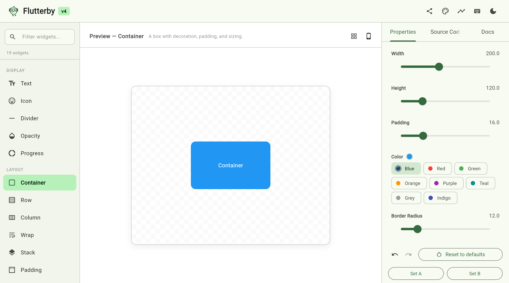

# Flutterby

An interactive Flutter widget explorer, design workbench, and reference tool. Select a widget, tweak its properties in real time, see a live preview with syntax-highlighted source code, read documentation with full property references, and export directly to DartPad.

Built with Flutter, for learning Flutter.



## Features

### Explore & Play
- **19 widgets** across 4 categories (Display, Layout, Input, Composite)
- **Live preview** with checkerboard background and animated crossfade transitions
- **Animated value transitions** — property changes smoothly animate in the preview (AnimatedContainer, AnimatedOpacity, AnimatedPadding, etc.)
- **Property editors** — text fields, sliders, toggles, and color-coded choice chips
- **Inline value previews** — color swatches, alignment dot grids, and semantic bool labels next to property values
- **Undo/redo** — per-widget property history with Ctrl+Z / Cmd+Z and redo, plus toolbar buttons
- **Keyboard navigation** — arrow keys to browse widgets instantly

### Design Tools (v4)
- **Share via URL** — encode widget + property state into a URL hash; paste the link to restore exact state. Copy with `s` key or Share button
- **Material3 Theme Builder** — HSL color wheel to pick a seed color, see the full ColorScheme (22 roles) as a swatch grid, toggle light/dark, copy `ThemeData` code. Seed color applies live to the app and all previews
- **Animation Curve Playground** — interactive Bezier curve editor with draggable control points, live animated ball, 16 Flutter curve presets, and copy `Cubic(...)` or `Curves.*` code
- **Device Frame Preview** — wrap the widget preview in realistic device frames: iPhone 16 Pro (dynamic island), Pixel 8 (punch-hole), iPad Air, Desktop (traffic lights). Toggle safe area visualization. Cycle with `d` key
- **Widget Variant Gallery** — toggle gallery mode (`g` key) to see a grid of the widget with systematic property variations across 1-2 axes. Click any cell to apply those values
- **Widget Diff / A-B Compare** — capture Snapshot A, tweak, capture Snapshot B. A morph slider interpolates between configs — doubles lerp, colors blend, enums snap at 0.5

### Learn
- **Docs tab** with documentation, full property reference table (name, type, required/optional, defaults), Material/Cupertino badges, and tappable related widget chips for discovery
- **Syntax-highlighted source code** — VS Code dark+ theme with line numbers and copy-to-clipboard
- **Code-property linking** — hover a property label to highlight the corresponding source line, and vice versa (wide layout)
- **Open in DartPad** — export any widget configuration as a runnable `main.dart` and iterate in DartPad

### Polished
- **Keyboard shortcuts** — press `?` to see all shortcuts: `/` to search, `1/2/3` for tabs, `r` reset, `c` copy, `t` toggle theme, `s` share, `g` gallery, `d` device frame
- **Responsive layout** — adapts across three breakpoints:
  - **Wide (900+px):** 3-panel layout (selector | preview | properties)
  - **Medium (600-900px):** sidebar + stacked preview/properties
  - **Compact (<600px):** single column with bottom navigation
- **Dark/light mode** toggle
- **State persistence** — remembers your selected widget, theme, seed color, device frame, and all edited property values across sessions
- **Search filter** for the widget list with category grouping
- **Reset to defaults** per widget

### Supported Widgets

| Category | Widgets |
|----------|---------|
| Display | Text, Icon, Divider, Opacity, Progress |
| Layout | Container, Row, Column, Wrap, Stack, Padding, Center, SizedBox |
| Input | ElevatedButton, TextField, Switch, Slider |
| Composite | Card, ListTile |

## Platforms

| Platform | Status |
|----------|--------|
| Web | Primary target |
| macOS | Supported |
| iOS | Supported |
| Android | Supported |
| Linux | Supported |
| Windows | Supported |

## Quick Start

```bash
# Web (primary)
flutter run -d chrome

# macOS
flutter run -d macos

# Or build and serve statically
flutter build web
cd build/web && python3 -m http.server 8080
```

## Tests

```bash
flutter test        # 21 tests (widget, URL state, interpolation, curve presets)
flutter analyze     # zero issues
```

## Architecture

```
lib/
├── main.dart                        # Entry point + persistence init + URL state
├── app.dart                         # App shell, responsive layouts, state management
├── models/
│   ├── widget_demo.dart             # WidgetDemo, PropertySchema, WidgetPropertyRef, PropertyVisualHint
│   ├── property_history.dart        # Per-widget undo/redo stack with debounced slider pushes
│   ├── theme_state.dart             # Seed color + brightness state
│   ├── curve_preset.dart            # Named Flutter curve presets with Bézier control points
│   ├── device_spec.dart             # Device frame specifications (iPhone, Pixel, iPad, Desktop)
│   └── property_interpolator.dart   # Per-type lerp logic for A/B compare morph
├── data/
│   └── widget_registry.dart         # All 19 widget demos with docs & properties
├── panels/
│   ├── widget_selector_panel.dart   # Left sidebar: search, categories, widget list
│   ├── preview_panel.dart           # Center: live widget preview with checkerboard, device dropdown, gallery toggle
│   ├── property_editor_panel.dart   # Right tab: interactive property controls + undo/redo + hover linking
│   ├── source_code_panel.dart       # Right tab: syntax-highlighted code + DartPad export + hover linking
│   ├── reference_panel.dart         # Right tab: docs, property reference, related widgets
│   ├── shortcuts_overlay.dart       # Modal overlay showing keyboard shortcuts
│   ├── theme_builder_panel.dart     # HSL color wheel + ColorScheme swatch grid
│   ├── curve_playground_panel.dart  # Interactive Bézier curve editor with animation preview
│   ├── device_frame_painter.dart    # CustomPainter device frames with status bars and notches
│   ├── variant_gallery_panel.dart   # Grid of widget variations across 1-2 property axes
│   └── compare_panel.dart           # A/B compare with morph slider
└── services/
    ├── dartpad_service.dart          # Wraps source in template, opens DartPad
    ├── persistence_service.dart     # SharedPreferences for session state
    ├── url_state_service.dart       # Encode/decode widget state to/from URL fragment
    ├── url_state_web.dart           # Web implementation (window.history.replaceState)
    └── url_state_stub.dart          # No-op stub for non-web platforms
```

**State management:** Plain `setState` with debounced persistence — no external state packages. Property values stored in a `Map<String, Map<String, dynamic>>` keyed by widget ID.

**Adding a widget:** Add one function to `widget_registry.dart` with a `WidgetDemo` (preview builder, source generator, property schema, docs) and append it to the registry list.

**Dependencies:** `url_launcher` (DartPad export), `shared_preferences` (session persistence), `web` (URL manipulation on web). Everything else is pure Flutter.
